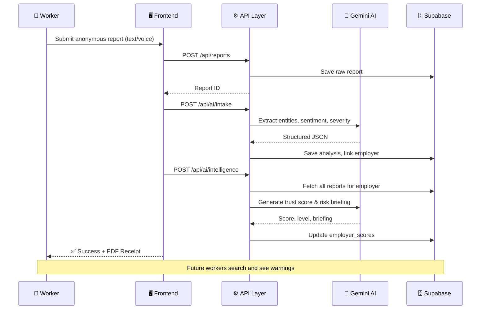

<p align="center">
  <h1 align="center">🛡️ WorkForWho</h1>
  <p align="center">
    <strong>AI-Powered Community Intelligence for Informal Workers</strong>
  </p>
  <p align="center">
    Workers report. AI analyzes. Communities are protected.
  </p>
</p>

<p align="center">
  
  
  
  
  
  
</p>

---

## 🎯 The Problem

**2 billion people** work in informal labor markets worldwide. They face wage theft, unsafe conditions, and exploitation — with **zero recourse**. There's no Glassdoor for day laborers, no Yelp for construction site safety, no data trail when employers cheat workers.

## 💡 The Solution

**WorkForWho** is a civic intelligence platform where workers anonymously report employer behavior. Google Gemini AI extracts structured risk signals, builds community trust scores, and generates plain-language warnings — so the **next worker knows before they accept the job**.

---

## 🏗️ Architecture

```
┌─────────────────────────────────────────────────────────────────┐
│                        WORKER INTERFACE                         │
│                                                                 │
│   ┌──────────────┐    ┌──────────────┐    ┌──────────────────┐  │
│   │  Text Report  │    │ Voice Report │    │ Employer Search  │  │
│   │   (Anonymous) │    │ (Transcribe) │    │ (Public Intel)   │  │
│   └──────┬───────┘    └──────┬───────┘    └────────┬─────────┘  │
│          │                   │                     │            │
└──────────┼───────────────────┼─────────────────────┼────────────┘
           │                   │                     │
           ▼                   ▼                     ▼
┌─────────────────────────────────────────────────────────────────┐
│                      API LAYER (Next.js)                        │
│                                                                 │
│   /api/reports          POST → Save anonymous report            │
│   /api/ai/transcribe    POST → Voice → Text (Gemini)           │
│   /api/ai/intake        POST → Extract risk vectors (Gemini)   │
│   /api/ai/intelligence  POST → Aggregate & score employer      │
│   /api/reports/pdf      POST → Generate PDF receipt             │
│   /api/employers/[id]   GET  → Public employer profile          │
│   /api/employers/search GET  → Search employers                 │
│   /api/seed             GET  → Seed demo data                   │
│                                                                 │
└────────────────────────────┬────────────────────────────────────┘
                             │
              ┌──────────────┼──────────────┐
              ▼                             ▼
┌──────────────────────┐      ┌──────────────────────────────────┐
│    GEMINI AI AGENTS   │      │         SUPABASE (PostgreSQL)    │
│                       │      │                                  │
│  ┌─────────────────┐ │      │  employers          reports      │
│  │  Intake Agent   │ │      │  employer_scores    ai_analyses  │
│  │  - Entity NER   │ │      │  employer_aliases   warnings     │
│  │  - Sentiment    │ │      │                                  │
│  │  - Severity 1-5 │ │      │  Row-Level Security (RLS)        │
│  │  - Issue tags   │ │      │  Anonymous insert policies       │
│  └─────────────────┘ │      │                                  │
│                       │      │                                  │
│  ┌─────────────────┐ │      │                                  │
│  │ Intelligence    │ │      │                                  │
│  │  Agent          │ │      │                                  │
│  │  - Trust Score  │ │      │                                  │
│  │  - Risk Level   │ │      │                                  │
│  │  - Risk Brief   │ │      │                                  │
│  │  - 4-Axis Score │ │      │                                  │
│  └─────────────────┘ │      │                                  │
└──────────────────────┘      └──────────────────────────────────┘
```

---

## ✨ Key Features

### 🎤 Anonymous Reporting (Text + Voice)
Workers submit reports without creating an account, logging in, or providing any identifying information. Voice reports are transcribed by Gemini AI in real-time.

### 🤖 Dual AI Agent Pipeline
- **Intake Agent** — Extracts employer name, location, issue categories (wage theft, unsafe conditions, harassment), sentiment, and severity from raw report text
- **Intelligence Agent** — Aggregates all reports for an employer, generates a **Trust Score (0-100)**, **Risk Level**, and a plain-language **Risk Briefing**

### 📊 4-Axis Community Intelligence
Each employer profile displays a multidimensional breakdown across four critical trust axes:
- **Wage Reliability** — Are workers paid fairly and on time?
- **Safety Standards** — Are working conditions safe?
- **Fairness** — Is treatment equitable and non-discriminatory?
- **Communication** — Are expectations clear and honest?

### 📄 PDF Report Receipt
After submission, workers can download a professionally formatted PDF receipt containing their report ID, AI analysis summary, risk assessment, and an anonymity & privacy notice.

### 🔍 Employer Search & Profiles
Public-facing employer profiles with trust scores, risk briefings, report timelines, and community-generated intelligence — searchable by name.

### ⚖️ Side-by-Side Employer Comparison
Workers can compare two employers directly using a dynamic, glassmorphism UI. It visually contrasts their Trust Scores, 4-Axis metrics, and AI Risk Briefings to help workers make immediate, data-driven decisions between job offers.

### 🔐 Secure Access Codes & Status Tracking
To maintain strict anonymity while allowing follow-ups, the system generates a random 8-character Secure Access Code (e.g., `A1B2C3D4`) upon report submission. Workers can enter this code in the Status Vault to view a live, animated timeline of their report (Signal Secured → AI Validating → Shield Active) without ever creating an account.

### 🛡️ Quota-Resilient Matching
When AI quota is exhausted, the system degrades gracefully: reports are saved, employers are matched via text-scan fallback, and users see a success confirmation — never an error.

---

## 🧰 Tech Stack

| Layer | Technology | Purpose |
|-------|-----------|---------|
| **Framework** | Next.js 16 (App Router) | Full-stack React with SSR |
| **Language** | TypeScript 5 | End-to-end type safety |
| **UI** | React 19 + CSS | Responsive, animated interface |
| **Database** | Supabase (PostgreSQL) | Auth, RLS, real-time |
| **AI** | Google Gemini 2.0 Flash | NLP extraction & aggregation |
| **Validation** | Zod 4 | Runtime schema validation |
| **PDF** | pdf-lib | Client-side receipt generation |
| **Deployment** | Vercel-ready | Edge-optimized |

---

## 📁 Project Structure

```
src/
├── app/
│   ├── page.tsx                    # Landing page with live stats
│   ├── report/page.tsx             # Anonymous report submission
│   ├── status/page.tsx             # Secure status tracker timeline
│   ├── employers/
│   │   ├── page.tsx                # Employer directory
│   │   ├── compare/page.tsx        # Side-by-side comparison tool
│   │   └── [id]/page.tsx           # Employer profile + 4-axis chart
│   └── api/
│       ├── reports/
│       │   ├── route.ts            # Save anonymous reports
│       │   ├── status/route.ts     # Look up report by access code
│       │   └── pdf/route.ts        # PDF receipt generator
│       ├── ai/
│       │   ├── intake/route.ts     # AI: Extract risk signals
│       │   ├── intelligence/route.ts # AI: Score & brief
│       │   └── transcribe/route.ts # AI: Voice → Text
│       ├── employers/
│       │   ├── [id]/route.ts       # Employer data API
│       │   └── search/route.ts     # Search API
│       └── seed/route.ts           # Demo data seeder
├── lib/
│   ├── ai/gemini.ts                # Gemini client (API Key + Vertex)
│   ├── supabase/                   # Supabase client configs
│   └── validation/                 # Zod schemas
├── types/
│   ├── database.ts                 # Supabase type definitions
│   └── index.ts                    # Shared types
└── supabase/
    ├── migrations/                 # SQL schema migrations
    └── seed.sql                    # Base seed data
```

---

## 🚀 Quick Start

### Prerequisites
- Node.js 18+
- A [Supabase](https://supabase.com) project
- A [Google AI Studio](https://aistudio.google.com) API key

### Setup

```bash
# 1. Clone the repo
git clone https://github.com/prajwal-govekar17/work-for-who.git
cd work-for-who

# 2. Install dependencies
npm install

# 3. Configure environment
cp .env.example .env.local
# Edit .env.local with your Supabase URL, keys, and Gemini API key

# 4. Apply database schema
# Run the SQL files in supabase/migrations/ in your Supabase SQL editor

# 5. Seed demo data
npm run dev
# Then visit http://localhost:3000/api/seed

# 6. Start developing
npm run dev
# Open http://localhost:3000
```

### Environment Variables

```env
NEXT_PUBLIC_SUPABASE_URL=https://your-project.supabase.co
NEXT_PUBLIC_SUPABASE_ANON_KEY=your-anon-key
SUPABASE_SERVICE_ROLE_KEY=your-service-role-key
GEMINI_API_KEY=your-gemini-api-key
```

---

## 🔄 How It Works



---

## 🎓 Design Decisions

| Decision | Rationale |
|----------|-----------|
| **No auth required** | Workers in vulnerable positions can't risk creating accounts |
| **Dual AI agents** | Separation of concerns: extraction ≠ aggregation |
| **Text-scan fallback** | Reports still match employers even when AI quota is exhausted |
| **Client-side PDF** | Receipt never touches the server — true anonymity |
| **4-axis scoring** | Multidimensional trust axes for granular community-based assessment |
| **Zod validation** | Runtime safety for AI outputs that can be unpredictable |

---

## 🌍 Impact

WorkForWho transforms isolated worker experiences into **collective intelligence**. One report is a complaint. A thousand reports are a **civic dataset** that protects communities, informs policy, and holds employers accountable.

> _"The best time to know about a bad employer is **before** you take the job."_

---

## 📜 License

MIT — use it, fork it, protect workers with it.

---

<p align="center">
  Built with ❤️ for workers who deserve better.
</p>
